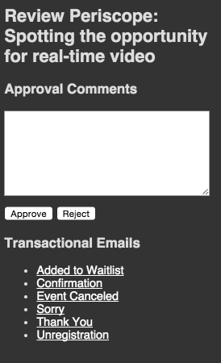

# Notifications

### Getting Started

- Notifications are the least intuitive and fun part of IER. HTML email in general can be a bit of a nightmare, and IER notifications are no exception to that rule.

- The default notifications are built with the standard Zurb Foundation CSS template for HTML emails.  **EDIT AT THE RISK OF YOUR SANITY!**

- The first thing you should do is read about the file structure of the notifications **[here](https://github.com/reg-support/reg-dev-guide/blob/master/file_structure/README.md#email)**.

### Testing

- The big pain point with IER Notifications is **testing**. There is simply no easy way to test what an email will look like without sending the email to yourself and letting your email provider render it for you.

- The least painful way is to use the IER Review feature. Create an event that has a status of _Building_. Then as you make changes, continue to send yourself the Review email. From this email you can access the Review portal and can send yourself copies of the notifications without having to commit a specific action on the platform.



- The only other way to get an email is to commit a specific action. I.E to receive an Event Cancellation notification, you will need to register for an event and then cancel the event.

### Liquid Tags

Unfortunately, the Liquid tags that are used in the IER Views differ from those used in the IER Notifications. Here is a list of the tags that are currently in use:

- Attend Page - `registrant.attend_page`
- Audio Passcode - `event.audio_provider.passcode`
- Authorization Code - `order.provider.auth_code`
- Conference ID - `event.audio_provider.conference_id`
- Custom Event Fields - `event.customs.field_name`
- Email Content - `email.content`
- Event Details Title - `event_details_title`
- Event Provider Type - `event.meeting_provider.type`
- Event Start Date - `event.start | date: 'MMMM d, yyyy'`
- Event Start Time - `event.start | date: 'h:mmtt'`
- Event Title - `event.title`
- First Name - `registrant.first_name`
- iCal - `event.icalendar_url`
- Order Date - `order.date`
- Order Item - `item.SessionId`
- Password Reset URL - `reset.url`
- Provider Name - `order.provider.name`
- Registrant PIN Code - `registrant.pin_code`
- Theme Settings - `theme.setting.name_of_setting` (_note the singular use of 'setting'_)
- Time Zone Abbreviation - `timezone.abbreviation`
- Toll Free Audio # - `event.audio_provider.toll_free_audio`
- Toll Audio # - `event.audio_provider.toll_audio`
- Transaction ID - `order.provider.transaction_id`
- Venue Address 1 - `venue.address.address1`
- Venue Address 2 - `venue.address.address2`
- Venue Locality - `venue.address.locality`
- Venue Name - `venue.name`
- Venue Postal Code - `venue.address.postal_code`
- Venue Region - `venue.address.region`

### Subject Line changes

- Change the subject line of any email with the following syntax:

```

```
