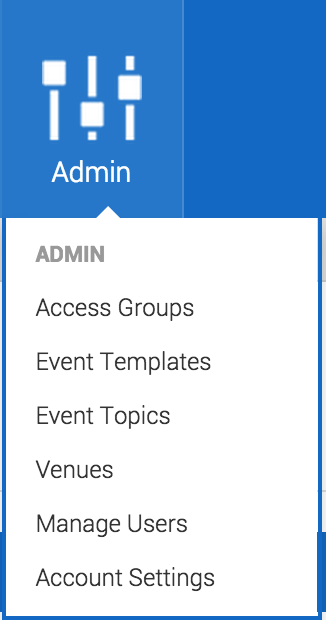
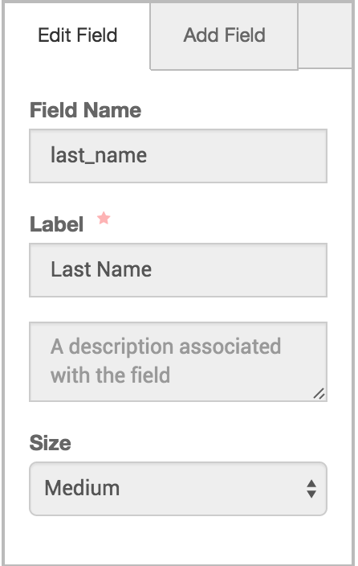
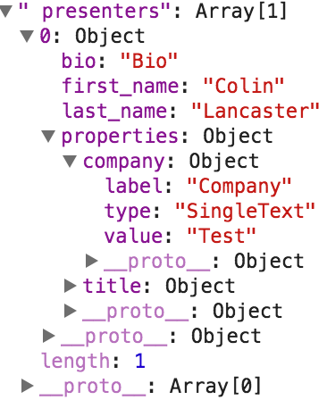

# Custom Presenter Fields

- Adding Custom Presenter fields starts in the Admin section of your theme.
- Click on the Admin button > Account Settings > Presenter Fields

- Add a field by clicking _Add Field_. Note the Field Name as you will be using it shortly.
- Any spaces in the Label Name are translated to underscores in the Field Name.

- The best thing to do at this point is to create a new event and fill out the new field while you are doing so.
- Now that you have your fields added in the Admin and filled out at the Event level, you need to make sure that your theme is set up to display the new fields.
- Everywhere that you want the field displayed, you will have to add an element that has a `data-bind` attribute.
- You can determine that the newly created field is accessible by looking through the returned JSON on a page that supports presenters (like the attend page or the event/details page).

- You can access your newly created field by using the following syntax:

`data-bind="text: properties.title.value"`

- If you had a field named company, you would replace the _title_ with _company_. Leaving you with:

`data-bind="text: properties.company.value"`

- After this step has been completed, re-upload your theme and you should be good to go.
- Keep in mind you will have to do this every place in the theme that you want the extra field displayed.
