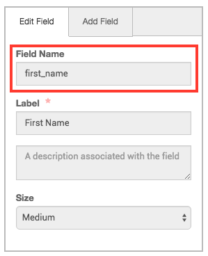
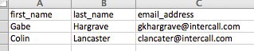
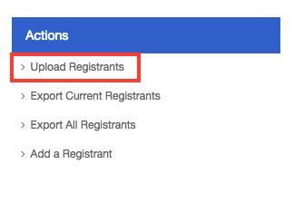

# <a name="top">Registration Importing

[Return to Main Page](https://github.com/reg-support/reg-dev-guide/blob/master/README.md)

- If you wish to do a bulk-import of a list of registrants, you can do so by using a CSV file with the registrants' information. This page will tell you how!

## Preparing the CSV File

- The CSV file you wish to upload must contain a column for **at least** each field you have specified in the "Registration Fields" section of your Event.
- Each column's header should be the value that appears in the "Field Name" box in the Registration Field Editor:

- Most events will require columns with the names "first_name", "last_name", and "email_address", but any further required custom columns you have added to the Event will need to have columns in this file as well.
- You can see a very simple example of a valid registrants file below:

## Uploading the File

- When you are ready to upload your CSV file, log into your iER account and navigate to the Event Details page for the Event in question. Then click on **Registrants** on the left-hand side.
- Once you are there, click on the **Upload Registrants** link in the "Action" panel on the right-hand side:

- In the dialog that pops up, select the CSV file from your local PC, and then click the **Upload** button. (At this point, if the file you are attempting to upload has any formatting errors, you will see an error message and be unable to proceed.)
- After a few seconds, you should be all finished! If there were any issues importing any of the registrants, you will see the error message(s) in red.

## A Few Notes...

- If you use the **Export All Registrants** feature from another meeting, you will get a CSV file containing registrants for that meeting. Unfortunately, this file is not correctly formatted for immediate use in importing to another meeting, because the export process strips underscores from the columns' headers (e.g. "first_name" becomes "first name"). If you wish to use this file, you will need to manually re-add the underscores to the column headers before the system will take your upload.
- If your CSV contains duplicate email addresses or addresses that are already registered, you will see an error message telling you so. However, this **should not** have any negative impact on the importing process. All non-duplicate registrants in the list should upload just fine. You may need to click "Cancel" in the upload window and refresh your browser to see the results.
- After you finish uploading, the page **will not** automatically refresh, so you will need to do so manually to see your newly-added registrants.
