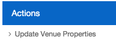
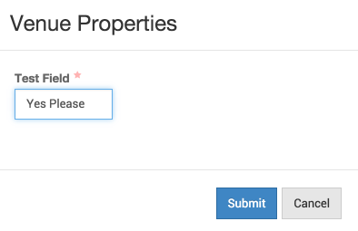

# Custom Venue fields

- Adding Custom Venue Fields starts in the Admin section of your theme.

- Click on the Admin button > Account Settings > Venue Properties

- Add your chosen property here. Take note of the Field Name that gets created when you type in your Label. As with Presenters, spaces get rendered into underscores.

- Then go back to the Admin button > Venues to continue.

- Then click _Create Venue_ on the right.

- Fill out the name and address of your venue.

- Then select the Venue Properties tab on the left, then Update Venue Properties on the right.

- Now, you have already created your venue property a few steps back, all you have to do is add a value to that property. This is the value that gets displayed to the registrants.

- The final steps are to set your map coordinates, and publish your venue.

- Once the venue has been added, create an Offline event and choose your newly created venue. Publish the event and go to the Event detail page for testing.

- Once again, your theme will need to have custom code added to it in order to display your new field.

- In this case, we named our custom field _Test Field_, which renders as _test_field_. Add the following code to any element that you would like bound:

`data-bind="text: properties.test_field.value"`

- Note that the _test_field_ portion is interchangeable with your other Field Names.
